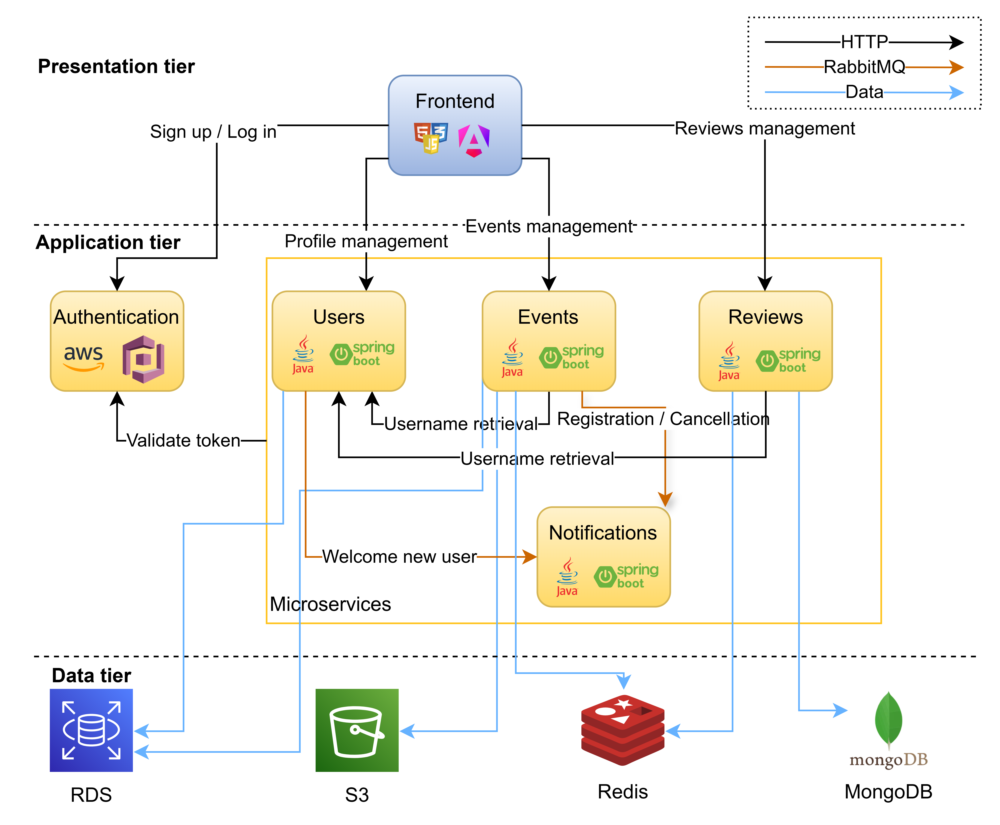
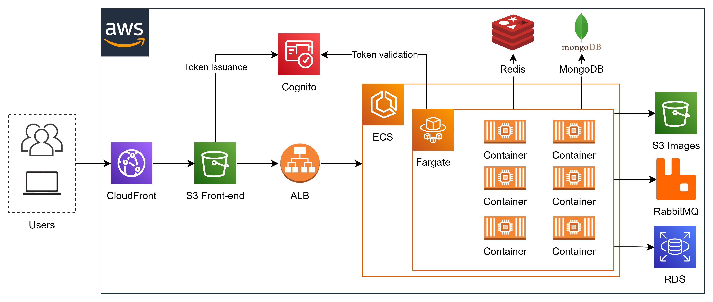

# WhatsThePlan – Production-Grade Microservices Platform | AWS Cloud Native | Spring Boot + Angular | Master's Thesis Project

## 📋 Project Overview

**WhatsThePlan** is a cloud-native social networking platform designed to connect users through local events and
activities. The platform allows users to create, discover, register for, and review events—built with a microservices
architecture, deployed entirely on AWS, and developed following modern software engineering practices. This
production-ready microservices platform demonstrates expertise in distributed systems, event-driven architecture, and
full-stack development using modern cloud-native patterns.

**Key Highlights:**

- 4 independent backend microservices (Java/Spring Boot)
- Single-page frontend (Angular/TypeScript)
- Fully automated CI/CD pipelines (AWS CodePipeline, CodeBuild, CodeDeploy)
- Cloud-native deployment on AWS using managed services
- Emphasis on software quality, scalability, and security

---

## 📘 Master's Thesis

This project was developed as part of my Master's Thesis in Software Engineering at Universidad Politécnica de Madrid
and serves as a practical case study in
designing, developing, and deploying a scalable, maintainable, and production-ready system using cloud infrastructure.
The complete thesis document provides in-depth analysis of:

- **Architectural decision-making** and trade-off analysis
- **Comprehensive requirements engineering** following ISO/IEEE 29148 standards
- **Quality attribute specification** and architectural tactics implementation
- **Detailed cloud infrastructure design** and cost optimization strategies
- **Empirical validation** through test automation and performance metrics

**Download full thesis:**
[Design and Deployment of a Social Network Using Microservices on AWS](https://oa.upm.es/89841/1/TFM_JOSE_LUIS_DE_MIGUEL_PEREZ.pdf)

---

## 🌐 Live Demo

A **mocked version** of the application is available at:  
[https://d7dp1q4urbiq5.cloudfront.net](https://d7dp1q4urbiq5.cloudfront.net)

**Note:** To minimize cloud costs, this demo uses mocked backend responses instead of live microservices. However, the
full user interface, navigation flow, and core interactions (registration, event browsing, reviews) remain fully
functional and testable.

---

## 🏗️ Architecture

### Software Architecture Overview

The system follows a **microservices architecture**, with each service owning its domain logic and data store. This
design promotes:

- **Loose coupling** and **high cohesion**
- Independent scaling and deployment
- Fault isolation and resilience

**Main Components:**

| Component                 | Responsibility                                                           | Tech Stack                               |
|---------------------------|--------------------------------------------------------------------------|------------------------------------------|
| **Frontend**              | User interface for event discovery, registration, and profile management | Angular, TypeScript, HTML/CSS            |
| **User Service**          | Manages user profiles and preferences                                    | Java, Spring Boot, PostgreSQL            |
| **Event Service**         | Handles event creation, updates, search, and registration                | Java, Spring Boot, PostgreSQL, Redis, S3 |
| **Reviews Service**       | Manages user-submitted reviews for event organizers                      | Java, Spring Boot, MongoDB, Redis        |
| **Notifications Service** | Sends transactional emails (welcome, registration, cancellation)         | Java, Spring Boot, RabbitMQ              |
| **Authentication**        | Handles user sign-up/login via OAuth 2.0 / OIDC                          | AWS Cognito                              |

**Communication Patterns:**

- Synchronous: REST APIs over HTTP/HTTPS
- Asynchronous: Event-driven messaging via RabbitMQ (e.g., for email notifications)

**Architectural Diagram:**

  

---

### Cloud Architecture Overview

The platform is deployed on **Amazon Web Services (AWS)** using a multi-tier, serverless-friendly infrastructure
designed for high availability, scalability, and security.

**Infrastructure Layers:**

| Layer            | AWS Services                                             | Purpose                                          |
|------------------|----------------------------------------------------------|--------------------------------------------------|
| **Presentation** | S3, CloudFront                                           | Hosts static Angular frontend with global CDN    |
| **Security**     | Cognito                                                  | Authentication, authorization, and secure access |
| **Application**  | ECS Fargate, ALB                                         | Containerized microservices with load balancing  |
| **Data**         | RDS (PostgreSQL), EC2 (MongoDB), ElastiCache (Redis), S3 | Structured, document, cache, and object storage  |
| **Messaging**    | Amazon MQ (RabbitMQ)                                     | Asynchronous communication between services      |
| **CI/CD**        | CodePipeline, CodeBuild, CodeDeploy, ECR                 | Fully automated build, test, and deployment      |

**Deployment Strategy:**

- Blue/green deployments via AWS CodeDeploy
- Health checks and automatic rollback
- Configuration managed via AWS Systems Manager Parameter Store

**Cloud Architecture Diagram:**

  

---

## ✨ Features

- **User Management**: Sign-up/login (email/password + Google OAuth), profile creation/editing
- **Event Management**: Create, update, delete, and search events with filters (location, date, category)
- **Event Registration**: Register/unregister with capacity validation
- **Reviews & Ratings**: Submit and view reviews for event organizers
- **Email Notifications**: Welcome, registration confirmation, and event cancellation emails
- **Responsive UI**: Modern, mobile-friendly interface built with Angular Material

---

## 🛠️ Tech Stack

| Category                 | Technologies & Tools                                                                                                 |
|--------------------------|----------------------------------------------------------------------------------------------------------------------|
| **Backend**              | Java 21, Spring Boot 3, Spring Security, Spring WebFlux, JUnit 5, Mockito                                            |
| **Frontend**             | Angular 17, TypeScript, HTML5, SCSS                                                                                  |
| **Databases**            | PostgreSQL (RDS), MongoDB (on EC2), Redis (ElastiCache)                                                              |
| **Cloud & DevOps**       | AWS (ECS, S3, CloudFront, Cognito, RDS, ElastiCache, Amazon MQ, CodePipeline, CodeBuild, CodeDeploy), Docker, GitHub |
| **Messaging**            | RabbitMQ (via Amazon MQ)                                                                                             |
| **Monitoring & Logging** | AWS CloudWatch, Spring Boot Actuator                                                                                 |
| **API Documentation**    | OpenAPI 3 (Springdoc)                                                                                                |

---

## 🧠 Key Engineering Decisions

### 1. Microservices over Monolith

- **Why**: To enable independent scaling, deployment, and technology choices per domain.
- **Benefit**: Improved fault isolation, faster release cycles, and team autonomy.

### 2. Domain-Driven Design (DDD)

- **Why**: To align software structure with business domains (Users, Events, Reviews, Notifications).
- **Benefit**: Clear bounded contexts, better maintainability, and easier onboarding.

### 3. Event-Driven Communication

- **Why**: To decouple time-consuming operations (e.g., sending emails) from user-facing requests.
- **Benefit**: Improved responsiveness and system resilience.

### 4. Containerization with ECS Fargate

- **Why**: To abstract infrastructure management and ensure consistent runtime environments.
- **Benefit**: Faster deployments, efficient resource usage, and easier scaling.

### 5. CI/CD Automation

- **Why**: To enable rapid, reliable, and repeatable deployments.
- **Benefit**: Reduced manual errors, faster feedback loops, and continuous delivery.

### 6. Multi-Store Persistence Strategy

- **Why**: To use the best database for each data type:
    - PostgreSQL for relational data (users, events)
    - MongoDB for flexible document storage (reviews)
    - Redis for caching and session data
- **Benefit**: Optimized performance and scalability per use case.

---

## 📈 Quality Attributes & Tactics

| Quality Goal        | Tactics Applied                                                                                         |
|---------------------|---------------------------------------------------------------------------------------------------------|
| **Scalability**     | Microservices, auto-scaling (ECS), load balancing (ALB), caching (Redis), pagination                    |
| **Reliability**     | Health checks, retry patterns, automated rollbacks                                                      |
| **Security**        | OAuth 2.0/OIDC (Cognito), JWT validation, RBAC, HTTPS enforcement, secrets management via SSM           |
| **Maintainability** | Modular design, comprehensive testing (90%+ coverage), structured logging, database migrations (Flyway) |
| **Performance**     | CDN (CloudFront), in-memory caching, reactive programming (WebFlux), asynchronous processing            |

---

## 📂 Repository Structure

This project is organized as separate repositories following microservices principles:

| Service                   | Repository                                                                             | Description                             |
|---------------------------|----------------------------------------------------------------------------------------|-----------------------------------------|
| **Frontend**              | [whatstheplan-frontend](https://github.com/JLDEMIGUEL/whatstheplan-frontend)           | Angular single-page application         |
| **Event Service**         | [whatstheplan-events](https://github.com/JLDEMIGUEL/whatstheplan-events)               | Core event management microservice      |
| **User Service**          | [whatstheplan-users](https://github.com/JLDEMIGUEL/whatstheplan-users)                 | User profile and preferences management |
| **Reviews Service**       | [whatstheplan-reviews](https://github.com/JLDEMIGUEL/whatstheplan-reviews)             | Review and rating functionality         |
| **Notifications Service** | [whatstheplan-notifications](https://github.com/JLDEMIGUEL/whatstheplan-notifications) | Email notification system               |

**Architecture Note:** Each microservice is independently deployable, versioned, and maintained in its own repository,
enabling autonomy, technology flexibility, and isolated scaling.

---

## 📚 API Documentation

Comprehensive API documentation is available as OpenAPI/Swagger specifications:

| Service             | Documentation                                                   | Description                                   |
|---------------------|-----------------------------------------------------------------|-----------------------------------------------|
| **User Service**    | [Users Swagger UI.pdf](./docs/swagger/Users Swagger UI.pdf)     | User profile management APIs                  |
| **Event Service**   | [Events Swagger UI.pdf](./docs/swagger/Events Swagger UI.pdf)   | Event creation, search, and registration APIs |
| **Reviews Service** | [Reviews Swagger UI.pdf](./docs/swagger/Reviews Swagger UI.pdf) | Review submission and retrieval APIs          |

---

## 📄 License

Academic project – not licensed for commercial use.
